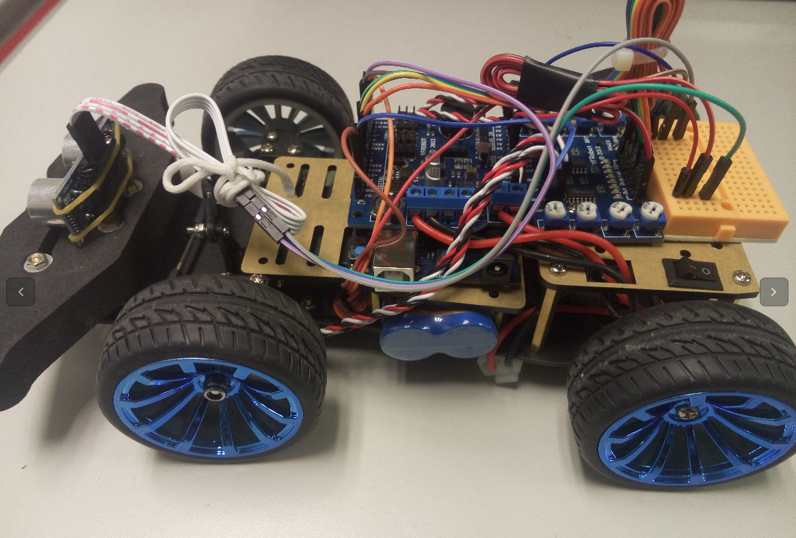
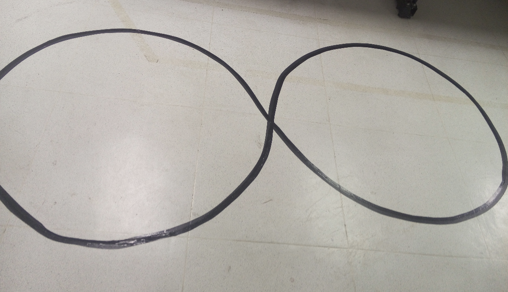
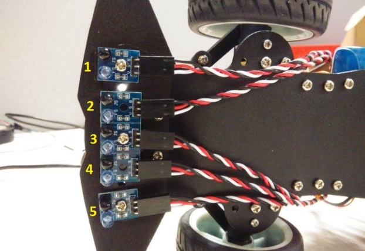
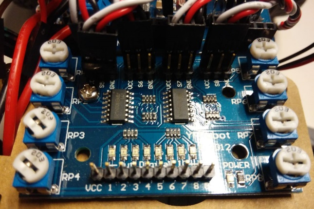
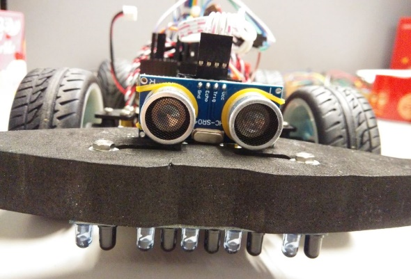
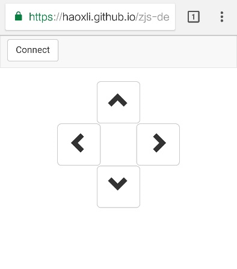

# Automatic Tracking RC Car Powered by Zephyr.js
Automatic tracking model is a kind of integrated intelligence system with independent judgment and decision-making ability, it combines mechanical, electronic, detection technology and intelligent control and has a wide range of applications in life such as material handling robots in automated production lines and automatic sorting robots in warehouse. 

This demo shows a JavaScript implementation of automatic tracking based on [Zephyr.js v0.5](https://github.com/intel/zephyr.js/tree/zjs-0.5) project, which is a lightweight web runtime for Zephyr OS that provides JavaScript APIs for small, embedded devices with little memory. In order to be able to automatic tracking, the demo have the function of path identification, direction decision, speed control, obstacle detection, and so on. It detects infrared sensor signal in real time to identify the black lines that have big difference from white ground colors, and controls forward direction based on the offset of the black line and the device. Accelerator is used for speed control, it will automatic to adjust motor power by PWM for speed up/down according to the acceleration calculated from sensor value. Once there is a obstacle on the trace, the ultrasound sensor can detect it in ms, the car will be braked and recovered tracking when the obstacle is removed. Manual mode is aslo added for BLE control, it will switch between manual mode and automatic mode when the car is connected or disconnect by BLE app.


## Device Requirements:
- Arduino 101 board
- PM-R3 motor drive board
-	Motor
-	Steering gear
-	Infrared module
-	Ultrasound module
-	Li-ion battery pack
- USB A/B cable

## Layout



## Environment
-	Need about 3m x 3m space, the ground should be in white or other lighter colors, and keep it clean.
-	Ambient light should not be too dark or bright, which will affect the signal of infrared sensor 
-	Use black tape (> 3cm) to lay a black track on white ground without any sharp corner, the radius of corner should be more than 60cm


## Build and Flash
- Get Source code: https://github.com/haoxli/zjs-demos and Zephyr.js
```
$ git clone https://github.com/haoxli/zjs-demos
$ git checkout osts-2018
$ git clone https://github.com/intel/zephyr.js
$ git checkout zjs-0.5
```
- Copy RC car files to Zephyr.js floder
```
$ cp -r zjs-demos/minicar/modules zephyr.js/
$ cp -r zjs-demos/minicar/main.js zephyr.js/
```
- Build
```
$ cd zephyr.js
$ source zjs-env.sh
$ make update
$ source deps/zephyr/zephyr-env.sh
$ make JS=main.js ROM=256
```
- Connect the Arduino 101 to your host with a USB A/B cable. Press the Master Reset button on the Arduino 101 and within 3-5 seconds type:
```
$ make dfu
```

## Calibration
-	Infrared sensor
The infrared sensor marked with 1-5 are connected to the pin 1-5 on control board, and the pins connect with IO4, IO7, IO8, IO10 and IO11 on Arduino 101. The LED corresponding to the pins will be lighting when the infrared signal is reflected and received, oppositely, if the signal is absorbed by dark objects, the LED will be turned off.



1. Regulate the sensitivity of the infrared sensors using the rheostats RP1-PR5 on the board, until all sensors can clearly identify the black line on the ground.
2. Try it on other color lines such as brown, blue etc., rotate the rheostats counterclockwise if the sensors could recognize them.
3. Repeatedly regulate them until the sensors can accurately identify the black line and are not disturbed by other color lines

- Ultrasound sensor
Connect the echo, trig and ground of ultrasound sensor to the IO2, IO13 and ground on Arduino 101. The sensor identifies the obstacle by ns, but the minimum of time unit for Zephyr.js is ms, so it is not possible to accurately calculate the obstacle distance, only be an approximate value.


The UltrasonicSensorDistance in the code is used for adjusting the distance, the default value is 10 which can detect obstacles within 20cm, and 15 for about 30cm. And the detection distance is also affected by the speed and braking time of RC car, set it to a reasonable value as needed in `main.js`.
```
var UltrasonicSensorCount = 0;
var UltrasonicSensorCountTmp = 0;
var UltrasonicSensorFlagTmp = false;
var UltrasonicSensorDistance = 10;
```

## Control Mode 
The RC car provides two modes: BLE control and automatic tracking. The default is automatic mode for self-driving on black trace. If it is connected with web app via BLE, it will stop automatic tracking and switch to manual mode, and recover to automatic mode once the BLE connection is closed. 



- Open Bluetooth on Android (6.0+)
- Load web app(https://haoxli.github.io/zjs-demos/minicar/) using Chrome browser(version 56+) 
- Click the ‘Connect’ button and choose ‘ZJS Demo’
- Tap direction button to control RC car by manual 


