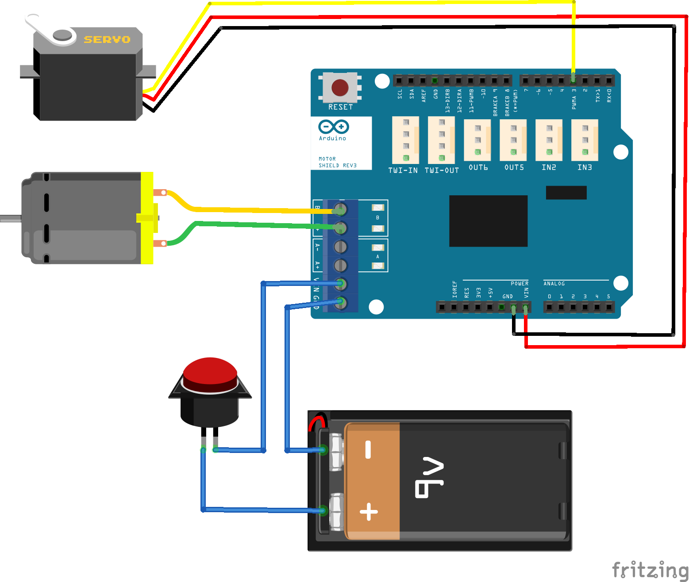

# Minicar
Minicar, an intelligent car demo based on [Zephyr.js](https://github.com/01org/zephyr.js/tree/master),using real-time detection of infrared and photoelectric sensor signal to achieve obstacle avoidance,and controlling by BLE and Joystick based on TCP Sockets.

## Required Zephyr.js Features
- Arduino 101 Pins
- PWM
- AIO
- GIPO
- BLE
- TCP

## Demo Features
- Turn left/right
- Coast/Brake/Forward/Reverse
- Obstacle aviodance
- Bluetooth/Joystick control

## Hardwares
- Arduino 101 (one more needed for joystick)
- PM-R3 Expansion Board
- Motor(JGA25-370)
- Steering Engine(MG996)
- Photoelectric sensor
- XBOX Joystick
- Bluetooth adapter

## Layout


## Building
1. Get Zephyr.js code
```
$ git clone https://github.com/01org/zephyr.js
$ cd zephyr.js
$ source zjs-env.sh
$ make update
```
2. Get zjs-demos
```
$ git clone https://github.com/thewebera/zjs-demos
```
Copy `modules`, `tests` and `main.js` to Zephyr.js

3. Build and Flash
```
$ cd zephyr.js
$ source zjs-env.sh
$ source deps/zephyr/zephyr-env.sh
$ make JS=main.js
$ make dfu
```
Detailed steps and dependences refer to Zephyr.js [README](https://github.com/01org/zephyr.js/blob/master/README.md).

## Controlling

This demo can be controlled by web app and joystick. Web app is designed using Web Bluetooth API,
and can connect with Arduino 101 through Bluetooth. Joystick need a singel Arduino 101 to communicate with car demo through TCP.

### Control with web app

1. Build `main.js` and flash it to Arduino 101, then reboot the device with the Master Reset button to start the application.

2. Open web app (https://thewebera.github.io/zjs-demos/minicar) on Android 6.0 with Chrome >= 56.

3. Click 'Connect' to connect app with Arduino 101.

### Control with joystick

1. Build `main-tcp.js` and flash it Arduino 101 (as car board), then reboot the device with the Master Reset button to start the application.
```
$ make JS=main-tcp.js
$ make dfu
```

2. Wiring joystick to another Arduino 101 (as joystick board)
* Wire all G on the JoyStick to GND on Arduino 101
* Wire all V on the JoyStick to Vcc(5v) on Arduino 101
* Wire X on the JoyStick to A0 on Arduino 101
* Wire Y on the JoyStick to A1 on Arduino 101
* Wire K on the JoyStick to A2 on Arduino 101

3. Wiring ENC28J60 ethernet to joystick board
* Wire GND on the ENC28J60 to GND on Arduino 101
* Wire VCC on the ENC28J60 to Vcc(3.3v) on Arduino 101
* Wire INT on the ENC28J60 to IO4 on Arduino 101
* Wire CS on the ENC28J60 to IO10 on Arduino 101
* Wire SI on the ENC28J60 to IO11 on Arduino 101
* Wire SO on the ENC28J60 to IO12 on Arduino 101
* Wire SCK on the ENC28J60 to IO13 on Arduino 101

4. Build `tests/test-tcp-joystick.js` and flash it to joystick board, then reboot the device with the Master Reset button to start the application.
```
$ make JS=tests/test-tcp-joystick.js
$ make dfu
```

5. Plugin bluetooth adapter on PC with Ubuntu 16.04, and run `tests/tools/test-tcp-adapter.py` to set the two boards connection.
```
$ sudo -i
# python tests/tools/test-tcp-adapter.py
```
